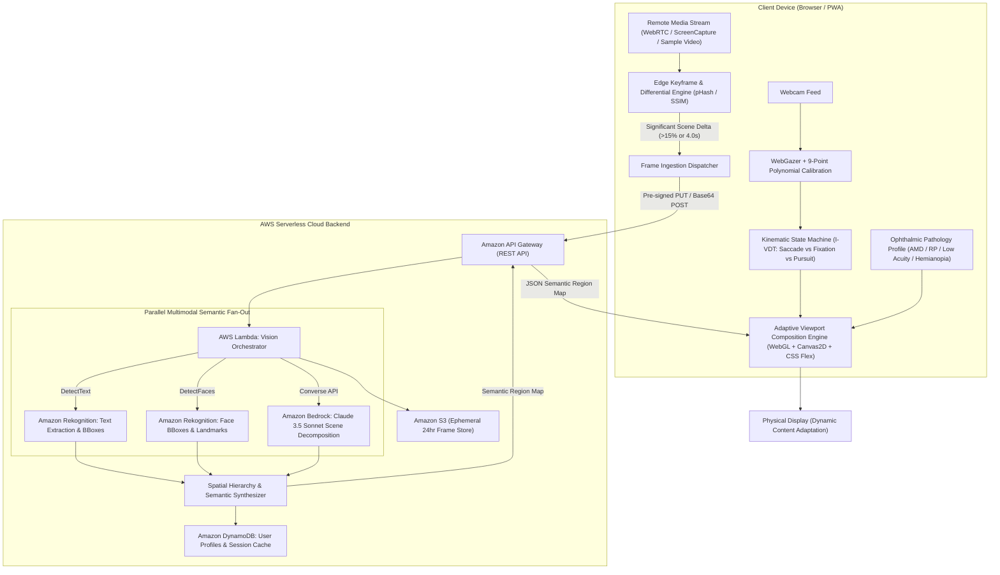

# FocalPoint: Gaze-Driven Semantic Media Adaptation for Low Vision

> **Hackathon Submission**: Bharat Builds Tour — First Commit (September 17–20, 2026)  
> **Tracks**: Cloud Track & Open Source Track  
> **Lead Architect**: Kanak Sanjay Waradkar ([@Labreo](https://github.com/Labreo))  
> **Repository**: Private Development Hub (`Labreo/focalpoint`)  

---

## Executive Summary & Engineering Thesis

Over **350 million people worldwide** live with moderate-to-severe visual impairment (Age-Related Macular Degeneration, Retinitis Pigmentosa, Diabetic Retinopathy, Cataracts, Hemianopia). When consuming remote or broadcast media (televisions, lecture slides, live sports scoreboards, news chyrons), existing assistive tools fail them:
1. **The Scanning Bottleneck**: Naive $4\times$ pixel zoom shrinks the viewable area, forcing continuous, exhausting horizontal scanning to read short phrases.
2. **The Midas Touch Problem**: In naive eye-tracking systems, every subconscious glance induces violent viewport movement, creating motion sickness and disorientation.
3. **Semantic Obliviousness**: Traditional magnifiers cannot distinguish high-priority text or scoreboards from static background grass or curtains.
4. **Uniform Pathology Fallacy**: Central vision loss (Macular Degeneration) and peripheral vision loss (Tunnel Vision) require fundamentally opposite optical corrections.

**FocalPoint** solves this through **Intent-Aware Semantic Content Reconstruction**. Rather than magnifying raw pixels, FocalPoint decomposes remote video into semantic entities via an AWS serverless pipeline:
- **Text Regions** are extracted via OCR and dynamically reflowed into readable, high-contrast, scalable **Atkinson Hyperlegible** typography.
- **Faces** are super-resolved and contrast-boosted to preserve lip-reading and emotional cues.
- **Scoreboards & Tickers** are pinned as invariant peripheral HUD overlays in functioning vision zones.
- **Eye Kinematics** are filtered via an **I-VDT (Velocity & Dispersion Threshold Identification) state machine** to eliminate the Midas Touch.
- **Pathology Profiles** dynamically remap visual space (annular eccentric projection for AMD, anamorphic radial compression for Retinitis Pigmentosa).

---

## System Architecture



---

## Mathematical Foundations & Kinematics

### 1. The I-VDT Kinematic Intent Classifier
Human visual kinematics consists of discrete saccades ($v > 300^\circ/\text{s}$, duration $20\text{--}50\text{ms}$ during which vision is suppressed) and fixations ($D(W) < 1^\circ$, duration $150\text{--}600\text{ms}$).

To resolve the Midas Touch, FocalPoint calculates spatial dispersion $D(W)$ and instantaneous velocity $v_t$ over a $200\text{ms}$ sliding window $W$:
$$D(W) = [\max(x_i) - \min(x_i)] + [\max(y_i) - \min(y_i)], \quad \forall G_i \in W$$
$$v_t = \frac{\sqrt{(x_t - x_{t-1})^2 + (y_t - y_{t-1})^2}}{\Delta t}$$

When $D(W) \le 65\text{px}$ and $v_t \le 40^\circ/\text{s}$, the system enters the **Fixation State**. A dwell accumulator increments until $t_{\text{dwell}} \ge 280\text{ms}$, triggering smooth semantic adaptation.

### 2. 2D Discrete Kalman Filter for Webcam Gaze Stabilization
Raw webcam gaze exhibits jitter ($\sigma^2 \approx 80\text{--}140\text{px}$). FocalPoint stabilizes coordinates at 60 FPS using a discrete Kalman filter:
$$\mathbf{x}_t = \begin{bmatrix} x_t \\ y_t \\ \dot{x}_t \\ \dot{y}_t \end{bmatrix}, \quad \mathbf{F} = \begin{bmatrix} 1 & 0 & \Delta t & 0 \\ 0 & 1 & 0 & \Delta t \\ 0 & 0 & 1 & 0 \\ 0 & 0 & 0 & 1 \end{bmatrix}, \quad \mathbf{H} = \begin{bmatrix} 1 & 0 & 0 & 0 \\ 0 & 1 & 0 & 0 \end{bmatrix}$$
$$\hat{\mathbf{x}}_{t|t} = \hat{\mathbf{x}}_{t|t-1} + \mathbf{K}_t(\mathbf{z}_t - \mathbf{H}\hat{\mathbf{x}}_{t|t-1})$$

---

## Ophthalmic Pathology Remapping

```
+--------------------------+-------------------------------+----------------------------------+
| Pathology                | Ophthalmic Condition          | FocalPoint Adaptive Strategy     |
+--------------------------+-------------------------------+----------------------------------+
| Age-Related Macular      | Central scotoma; loss of      | Preferred Retinal Locus (PRL)    |
| Degeneration (AMD)       | high-acuity foveal cones.     | Annular Projection outside blind |
|                          |                               | spot with Gaussian-feathered mask|
+--------------------------+-------------------------------+----------------------------------+
| Retinitis Pigmentosa     | Peripheral field loss;        | Anamorphic Radial Compression:   |
| (Tunnel Vision)          | tunnel vision (< 15-20°).     | Non-linear squeeze into fovea:   |
|                          |                               | r' = R_tunnel * (r/R_max)^gamma  |
+--------------------------+-------------------------------+----------------------------------+
| Diabetic Retinopathy /   | Scattered spots, contrast     | Contrast Boost + Dynamic Reflow: |
| Low Visual Acuity        | loss, severe blur.            | Atkinson Hyperlegible glyphs     |
|                          |                               | with high-contrast color themes  |
+--------------------------+-------------------------------+----------------------------------+
| Homonymous Hemianopia    | Loss of half visual field     | Saccadic Fold: Merges blind-side |
| (Post-Stroke)            | (left or right hemifield).    | information into sighted half    |
+--------------------------+-------------------------------+----------------------------------+
```

---

## Cyber-Ophthalmic UI/UX Design System

FocalPoint replaces the clinical, garish look of legacy accessibility software with a **Cyber-Ophthalmic Design Language**:
- **OLED Midnight Canvas** (`#050811`) with sub-pixel frosted glass (`backdrop-filter: blur(24px)`).
- **Atkinson Hyperlegible Typography** (designed by the Braille Institute of America) to prevent letterform ambiguity (`B` vs `8`, `I` vs `l` vs `1`).
- **WCAG 2.2 AAA Contrast**:
  - *Obsidian Amber* (`#FDE047` on `#050811`, **19.4:1**)
  - *Carbon Cyan* (`#38BDF8` on `#050811`, **13.5:1**)
  - *Midnight Mint* (`#4ADE80` on `#070D18`, **14.8:1**)
- **Concentric Gaze Reticle**: Inner dot with an animated SVG radial dwell ring that visually winds $0^\circ \to 360^\circ$ over the $280\text{ms}$ fixation window.
- **Synthesized Web Audio Haptics**: High-pitch crystal chimes ($880\text{Hz}$) on fixation lock (zero external MP3 dependencies).
- **Caregiver & Evaluator Pathology Simulator**: An interactive diagnostic overlay toggle allowing sighted judges to experience the simulated visual impairment in real time.

---

## Master Viewport Wireframe

```
+---------------------------------------------------------------------------------------------------------+
| [FOCALPOINT]  ● LIVE | 60 FPS | Gaze: 18ms | AWS Latency: 640ms | Profile: [ AMD - Eccentric PRL ▼ ]   |
+---------------------------------------------------------------------------------------------------------+
|                                                                                                         |
|     +-- SEMANTIC REGION: PERSISTENT HUD -----------------+                                              |
|     |  IND 287/4  (42.3 ov)  •  TARGET 324  [PINNED]     |  <-- Detected Sports Scoreboard              |
|     +----------------------------------------------------+                                              |
|                                                                                                         |
|                                  ( )  <-- Gaze Reticle (Saccadic state: faint cyan guide ring)          |
|                                                                                                         |
|                                                     +-- SEMANTIC REGION: FACE ----------+               |
|                                                     |       [ SPEAKER PORTRAIT ]        |               |
|                                                     |       Super-Resolved & Sharpened  |               |
|                                                     +-----------------------------------+               |
|                                                                                                         |
|         (( * )) <-- Gaze Fixation on News Banner (Dwell Progress: 85% [==================  ])           |
|                                                                                                         |
|   +-- SEMANTIC REGION: TEXT BLOCK ------------------------------------------------------------------+   |
|   |  BREAKING NEWS: Supreme Court issues final ruling on renewable transmission grid corridor...    |   |
|   +-------------------------------------------------------------------------------------------------+   |
|                                                                                                         |
+---------------------------------------------------------------------------------------------------------+
| [F1] Calibrate  |  [F2] Freeze Frame  |  [F3] Contrast Mode  |  [F4] Toggle Pathology Simulator (Caregiver) |
+---------------------------------------------------------------------------------------------------------+
```

---

## Universal Accessibility: Keyboard Simulation

For users with severe nystagmus or absent webcams, full functionality is accessible via the keyboard matrix:
- **Numpad 1–9**: Immediately steers gaze coordinates to corresponding $3\times3$ screen sectors.
- **Spacebar**: Freeze / pause remote stream for relaxed inspection.
- **`+` / `-`**: Step typography size up/down by 0.25rem.
- **`T`**: Trigger Amazon Polly Text-to-Speech audio read-aloud.
- **`C`**: Cycle high-contrast color palettes.
- **`P`**: Cycle pathology modes (AMD $\to$ RP $\to$ Low Acuity).
- **`S`**: Toggle Caregiver/Judge Pathology Simulation Overlay.

---

## Repository Structure

```
focalpoint/
├── AGENTS.md                 # Operational manual and AI instructions
├── README.md                 # Master system documentation
├── .gitignore                # Production ignore rules (*.html, node_modules, etc.)
├── backend/                  # AWS Serverless Lambda & SAM resources
│   ├── handlers/             # orchestrator.py, rekognition_client.py, bedrock_client.py
│   └── template.yaml         # CloudFormation / SAM template
└── frontend/                 # Next.js 15 Client application
    ├── app/                  # App Router pages (master viewer, calibration, profile)
    ├── components/           # AdaptiveViewport, GazeReticle, ReflowDrawer, PersistentHUD
    ├── lib/                  # eye_kinematics.ts, kalman_filter.ts, pathology_transforms.ts
    └── styles/               # globals.css high-contrast WCAG AAA tokens
```

---

## License & Compliance

Licensed under the **Apache License, Version 2.0**.  
Compliant with **WCAG 2.2 AAA** accessibility guidelines and section 508 standards.
